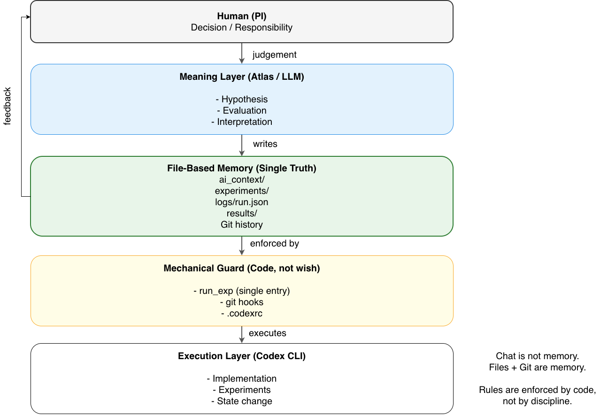
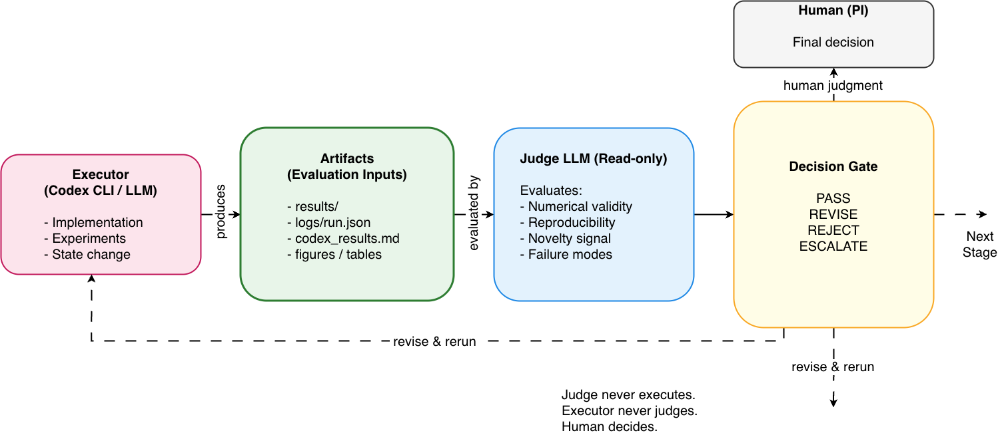

# Principles  

## ― このフレームワークが削らない原則 ―

このドキュメントは、  
**「何を足すか」ではなく「何を削らないか」**を定義する。

運用の中で迷ったら、  
仕様よりもコードよりも、  
**まずここに戻る**。

---

## 原則 0：このフレームワークは人を信用しすぎない

- 人は忘れる
- 人は急ぐ
- 人は雑になる

これは欠点ではなく、前提条件。

このフレームワークは  
**注意力や善意に依存しない**ように設計する。

---

## 原則 1：共有記憶はファイルと Git だけ

- チャットは思考の場
- LLMの記憶は信用しない
- 共有されるのは **ファイルだけ**

**後から再現・検証できるもの**だけを、  
知識として扱う。

---

## 原則 2：成果物は必ず由来とセットで扱う

成果（results/）には必ず：

- どのコードで
- どの設定で
- どう実行したか

が紐づく。

`logs/run.json` が無い成果は、  
**未同定の成果**として扱う。

##### 原則：成果物はコードバージョンと不可分である

成果物（results/）は、それを生成したソースコードのバージョンと
切り離して扱ってはならない。

そのため、
- project repo の commit
- framework repo の commit（該当する場合）

は `logs/run.json` に必ず記録される。

commit 情報が無い成果は、正式な成果として扱わない。

------

## 原則 3：dirty な実行は明示的に扱う

未コミットの変更を含む実行は、
`dirty=true` として記録される。

dirty な成果物は、
再現性が不明確であることを前提に扱う。

実行の可否は制限しないが、
正式な成果として扱うかどうかは
人間が判断する。

---

## 原則 4：実行経路は一本にする

- `python main.py`
- `julia run.jl`

のような **直接実行は禁止**。

実行は必ず：

~~~
./bin/run_exp <exp_name>
~~~

を通す。

再現性は、  
**入口を一つにして初めて守れる**。

---

## 原則 5：安全装置はコードで強制する

- 危険な操作は `.codexrc` で防ぐ
- 漏れは git hook で止める
- ルールは「お願い」ではなく「物理」

人の注意力を消耗させない。

---

## 原則 6：記録は最小でよいが、必ず残す

完璧な文章は不要。

最低限：

- なぜやったか
- 何をしたか
- どうなったか

が分かれば十分。

**書かない自由はないが、短く書く自由はある。**

---

## 原則 7：フレームワークとプロジェクトを混ぜない

- framework repo  
  - 思想・仕組み・雛形
  - 成果物は置かない
- project repo  
  - 実験・コード・結果
  - framework を submodule として参照

境界が曖昧になると、  
再現性は必ず壊れる。

---

## 原則 8：フレームワークは参照点であり、拘束具ではない

- project repo 側では自由に改変してよい
- hook を外してもよい
- run_exp を書き換えてもよい

ただし：

> **破ったなら、破った理由を残す**

それだけで十分。

---

## 原則 9：判断は人間が行う

- LLMは提案する
- LLMは整理する
- LLMは評価することもある

しかし：

- 採用するか
- 捨てるか
- 論文にするか

を決めるのは、常に **人間**。

---

## 原則 10：最初から全部使わない

- ai_context を全部使う必要はない
- Judge を使わなくてよい
- 論文化を急がなくてよい

**1実験・1結果・1commit**  
から始めてよい。

---

## 最後に

この原則は、  
「正しさ」を保証するものではない。

ただし、

> **後から振り返れる研究・実験**

である確率を、  
かなり高くする。

それで十分だと考える。

---

削りたくなったら、  
まずどの原則かを確認してからにしよう。